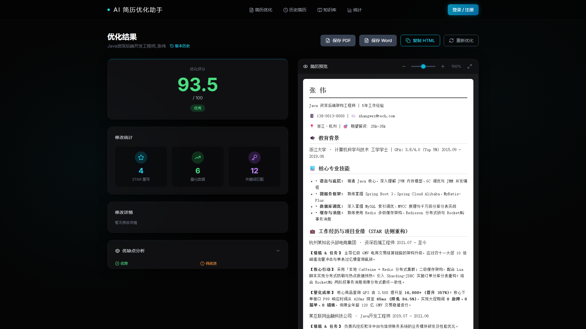

# 💻个人工程作品集 (Engineering Portfolio)

  
  
  
  

欢迎访问我的个人软件工程作品集！本仓库收录了我近期独立/主导完成的核心工程项目，每个项目均包含**完整的系统架构设计、高清运行截图、业务功能清单以及真实环境全流程测试验证记录**。

---

## 🚀 精选项目索引

### 📌 项目一：[看板式敏捷项目任务管理系统](./看板式项目任务管理系统/README.md)

> 基于 **Spring Boot 3 + Vue 3 + MySQL 8.0** 打造的前后端分离敏捷协作平台。

* **核心技术栈**：Java 21, Spring Boot 3.5, MyBatis-Plus, MySQL 8.0, JJWT, BCrypt, Vue 3, Element Plus, ECharts 6.0, VueDraggable
* **核心功能亮点**：
  * **四列任务看板**：待办/进行中/已完成/已阻塞流转，支持拖拽排序与阻塞审批流。
  * **甘特图与关键路径**：FS 依赖关联与算法自动高亮关键路径（Critical Path）。
  * **ECharts 效能统计**：动态任务分布柱状图与 Sprint 交付燃尽图。
  * **全流程闭环**：包含 13 张完整运行高清截图、架构蓝图与 14 项实测验证记录。
* 👉 **[点击进入：查看看板系统完整详情与系统截图](./看板式项目任务管理系统/README.md)**

  

---

### 📌 项目二：[AI 智能简历优化与服务平台](./ai简历助手/README.md)

> 基于 **FastAPI + 大模型 API + Tailwind CSS** 构建的一站式求职简历优化服务系统。

* **核心技术栈**：Python 3.12, FastAPI 0.115, Uvicorn, SQLAlchemy 2.0, SQLite 3, Pydantic, DashScope / Qwen API, Playwright
* **核心功能亮点**：
  * **STAR 法则结构化重构**：大模型定向改写经历，量化成果增强，关键词精准匹配。
  * **沙箱高保真预览**：iframe 隔离渲染高保真 HTML 简历，支持 Word (.docx) 结构化导出。
  * **岗位库与知识库沉淀**：内置 40+ 岗位库检索，四大类求职最佳实践自动抽取入库。
  * **工程级健壮性**：大模型异常事务自动回滚，遵循 RFC 5987 / 6266 标准解决中文文件名编码兼容问题。
* 👉 **[点击进入：查看 AI 简历平台完整详情与系统截图](./ai简历助手/README.md)**

  

---

### 📌 项目三：[智学伴 · 自律学习与AI互助微信小程序及管理平台](./智学伴自律学习与AI互助平台/README.md)

> 基于 **Spring Boot 3 + 微信原生小程序 + Vue 3 后台 + 双轨 AI 引擎** 打造的自律学习与智能互助生态平台。

* **核心技术栈**：Java 21, Spring Boot 3.5, MyBatis-Plus, MySQL 8.0, 微信小程序, Vue 3, Element Plus, JJWT, BCrypt, DeepSeek / OpenAI API
* **核心功能亮点**：
  * **SMART 阶段计划与每日清单打勾**：支持四六级/考研阶段计划倒计时与目标细分，每日任务打勾即时触发微触感振动反馈与 +5 🪙 自律金币激励；首页嵌入轻量微件，即点即存。
  * **全维度自律学霸排行榜**：日榜/周榜/连续打卡榜/学分榜四维排位，动态算法推导与上一名学霸的分钟差距并生成趣味超越激励文案。
  * **社区悬赏答疑与采纳分发闭环**：发帖质押悬赏金币（🪙 10/20/50），楼主一键采纳优质回复为最佳答案，事务原子转账并结案。
  * **双轨 AI 智能导师与助教**：打卡后生成个性化复盘寄语；社区疑难贴支持**一键召唤 AI 助教生成分步解题思路**；具备 5s 超时自适应容灾降级机制。
  * **事前风控与工程级规范**：前置敏感词字典拦截（返回 `1201` 零脏数据入库），严谨的 12 张关系型业务表设计，配套自动化代码生成的规范 UML 时序图与 E-R 图纸。
* 👉 **[点击进入：查看智学伴完整详情与系统截图](./智学伴自律学习与AI互助平台/README.md)**

  

---

## 🛠️ 工程素养与交付标准

在项目推进与交付过程中，我始终坚持**“真实可用、文档完备、规范严谨”**的工程准则：

1. **结构化交付体系**：每个项目均配备 `01_作品集截图`、`02_功能清单`、`03_技术栈与项目结构`、`04_运行验证记录` 标准化文档。
2. **端到端问题攻坚**：具备深入网络链路排查跨端编码（如 RFC 5987）、跨域 CORS 及拦截鉴权等实际工程问题的解决能力。
3. **AI 协同工程化提效**：熟练利用 Claude、DeepSeek 等 AI 工具链进行规范化需求拆解、测试用例推导与敏捷迭代。

