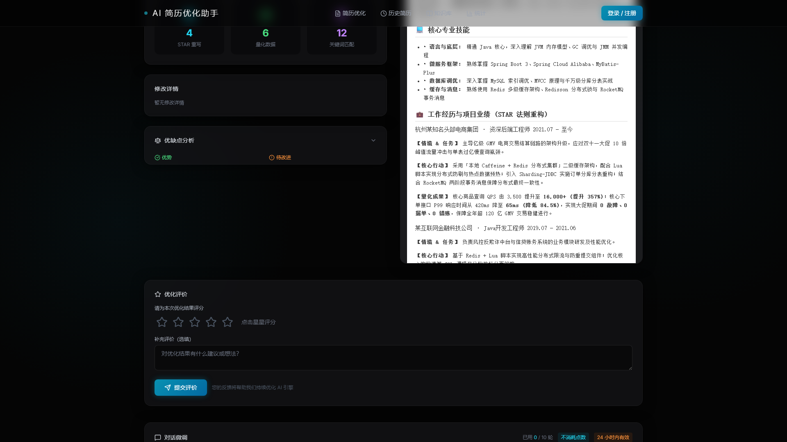
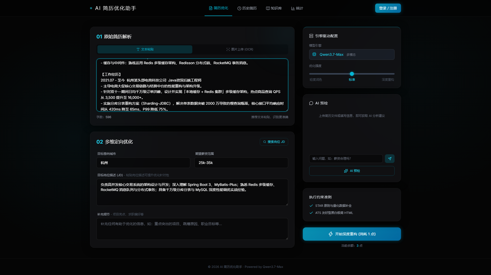
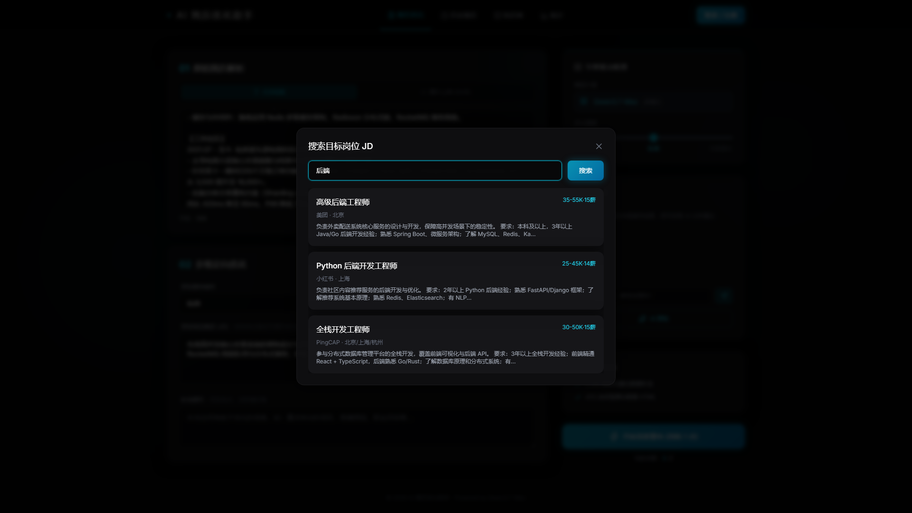
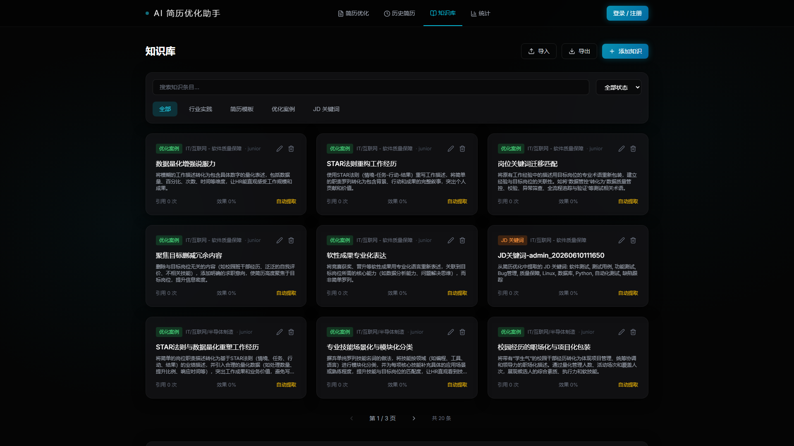
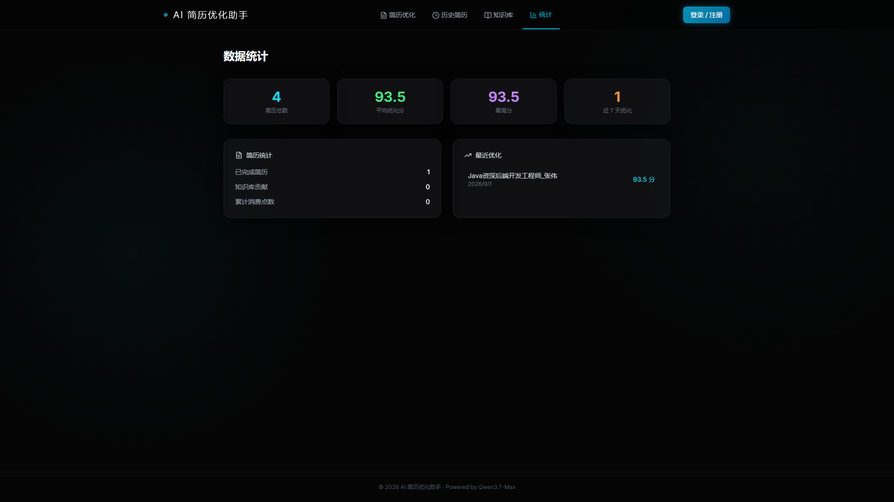
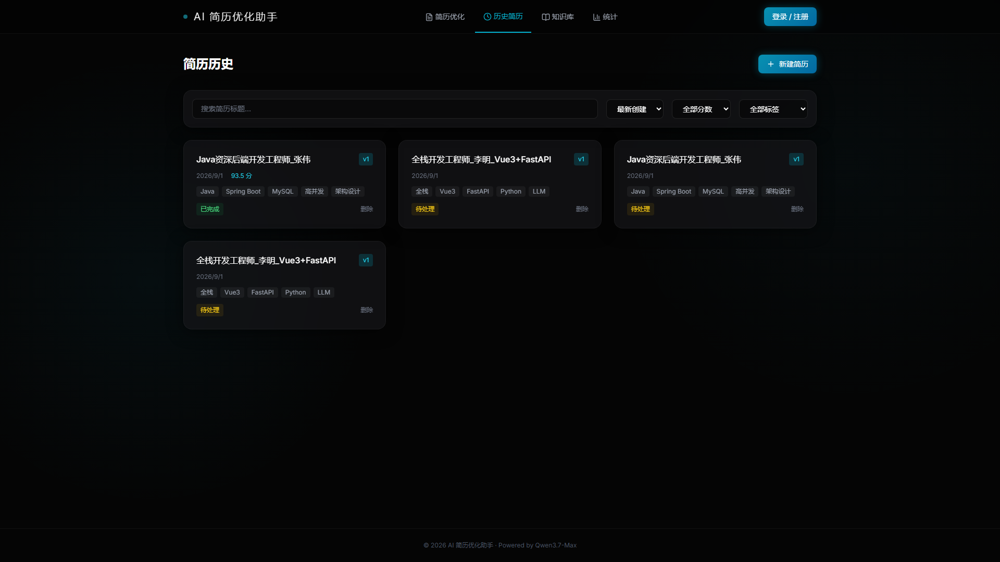
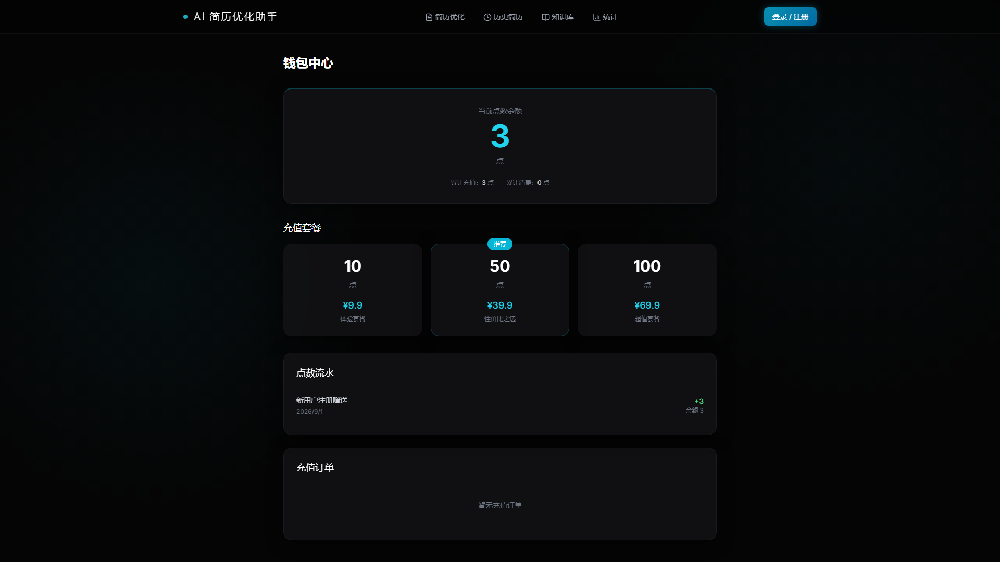

# AI 智能简历优化与服务平台 (AI Resume Optimizer)

<p align="center">
  
  
  
  
  
  
</p>

---

## 📖 项目简介

**AI 智能简历优化平台** 是一套基于大语言模型（LLM）与现代异步 Web 架构构建的**求职赋能全栈系统**。针对求职者在传统简历编写中存在的“流水账无亮点、缺乏 STAR 法则支撑、与目标岗位 JD 关键词脱节、难以量化成果”等痛点，系统提供从简历多模态导入、智能岗位匹配、深度结构化改写、多轮对话微调、版本回溯到 Word 导出的**一站式全闭环解决方案**。

系统采用 FastAPI 高性能异步底座，搭配磨砂玻璃科技感暗黑主题设计，内置知识库自动沉淀与点数钱包交易体系，全链路通过自动化测试验证。

---

## 🌟 核心业务功能与界面展示

### 1. 优化结果展示：STAR 法则高保真重构与维度统计
* **高保真沙箱预览**：采用 iframe 容器隔离渲染优化后的结构化 HTML 简历，杜绝样式污染。
* **智能维度诊断**：输出综合匹配评分（0-100 分）、STAR 改写段落数、量化指标注入统计、修改摘要与优势分析。

| STAR 法则高保真简历预览 | 维度统计与修改建议 |
| :---: | :---: |
|  |  |

---

### 2. 交互工作台：多模态导入与智能岗位 JD 检索
* **多模态简历输入**：支持多段文本直接粘贴与图像 OCR 识别（视觉模型自动提取文字）。
* **内置岗位库检索**：集成 40+ 典型行业技术岗位 JD，支持模糊搜索并一键注入工作台配置。
* **改写强度可控**：提供 1~5 级改写强度滑块（从轻度润色到深度重构）。

| 简历工作台编辑 | 内置岗位库智能搜索 |
| :---: | :---: |
|  |  |

---

### 3. 简历知识库与最佳实践沉淀
* 涵盖四大分类：**行业最佳实践、标准简历模板库、经典优化范例 (Few-Shot)、高频 JD 关键词库**。
* 支持大模型改写过程中的异步知识模式抽取、沉淀入库与多维度分类统计导出。



---

### 4. 数据监控仪表盘与版本谱系追踪
* **仪表盘分析**：实时统计个人优化总量、均分走势图表与近 7 天优化趋势折线图。
* **历史版本管理**：基于 `parent_id` 维护简历多次优化的版本历史（v1, v2...），支持随时回溯对比。

| 数据效能仪表盘 | 历史简历版本管理 |
| :---: | :---: |
|  |  |

---

### 5. 个人钱包与点数交易闭环
* 新用户注册自动赠送免费点数；支持 3 档灵活充值套餐与模拟支付。
* **事务原子性保障**：优化消费与点数变动严格绑定，若下游大模型调用异常自动回滚，杜绝异常扣点。



---

## 🏗️ 系统分层架构

```text
[浏览器前端 SPA] (HTML5 / Tailwind CSS / Lucide Icons / 原生 ES6+ 模块化)
       │
       ▼ Fetch API 异步请求 (携带 Authorization: Bearer <JWT>)
[FastAPI Web 引擎] (Uvicorn ASGI 异步服务器，支持 CORS 与静态资源挂载)
       │
       ▼
[Pydantic 验证层] (入参契约校验、Schemas 强类型声明、Header 规范化)
       │
       ▼
[Routers 路由层] (/api/auth, /api/resume, /api/optimize, /api/jobs, /api/payment)
       │
       ▼
[Services 业务层] ──┬── [LLM Service] (OpenAI 协议封装，容错重试与 Prompt 注入)
                     ├── [Payment Service] (钱包流水管理与事务原子性消费)
                     ├── [Docx Service] (HTML 结构化转换为 Word .docx 文件)
                     └── [Job / Knowledge Service] (岗位检索与知识资产检索)
       │
       ▼
[SQLAlchemy 2.0 ORM] (声明式模型映射、SessionLocal 事务生命周期管控)
       │
       ▼
[SQLite 3 数据库] (ai_resume_optimizer.db, 包含 users, resumes, wallets 等核心表)
```

---

## 🛠️ 技术栈清单

### 后端技术栈 (Backend)
* **核心框架**：`FastAPI 0.115.0` + `Uvicorn 0.34.0`（高性能异步 ASGI 架构）
* **ORM 与数据库**：`SQLAlchemy 2.0.36` + `Alembic 1.14.0` + `SQLite 3`
* **数据校验**：`Pydantic 2.10.0`
* **身份与安全**：`python-jose 3.3.0` (JWT) + `passlib[bcrypt] 1.7.4`
* **网络与大模型**：`httpx 0.28.0`（异步非阻塞调用 DashScope / Qwen API）
* **文档与多模态**：`python-docx 1.1.2` + `Pillow 11.0.0`
* **自动化测试**：`pytest 9.1.1` + `Playwright 1.62.0`（无头浏览器截图与全要素验证）

### 前端技术栈 (Frontend)
* **架构范式**：单页应用 (Single Page Application, SPA)
* **样式引擎**：`Tailwind CSS`（磨砂玻璃科技感暗黑主题设计）
* **图标系统**：`Lucide Icons`
* **富文本容器**：安全沙箱 `iframe` 容器（隔离渲染优化 HTML）

---

## 🚀 快速启动指南

### 1. 运行环境
* **Python**：Python 3.10+ (推荐 3.12)
* **操作系统**：Windows / macOS / Linux

### 2. 依赖安装
```bash
pip install -r requirements.txt -i https://pypi.tuna.tsinghua.edu.cn/simple
```

### 3. 启动服务
```bash
python -m uvicorn backend.main:app --host 127.0.0.1 --port 8000 --reload
```

### 4. 访问系统
* **前端控制台**：打开浏览器访问 `http://127.0.0.1:8000`
* **Swagger 交互文档**：访问 `http://127.0.0.1:8000/docs`

---

## 📋 交付文档索引

* 📄 **[01_作品集截图](./01_作品集截图/)**：涵盖 11 张 1920×1080 真实系统运行高清截图。
* 📄 **[02_功能清单.md](./02_功能清单.md)**：包含全模块 API 契约与业务功能清单。
* 📄 **[03_技术栈与项目结构.md](./03_技术栈与项目结构.md)**：分层工程架构、目录结构与数据模型说明。
* 📄 **[04_运行验证记录.md](./04_运行验证记录.md)**：包含环境部署、接口测试通过清单及兼容性 Bug 修复记录。
