# 智学伴 · 自律学习与AI互助微信小程序及管理平台 (Zhixueban)

<p align="center">
  
  
  
  
  
  
  
  
  
</p>

---

## 📖 项目背景与定位

在考研、考证、期末备考等高强度自主学习场景中，广大学员普遍面临**“注意力易涣散、自律打卡缺乏长效激励、疑难问题在自习时难以及时答疑、社区互动易受低俗违规信息侵扰”**等核心痛点。

**智学伴 (Zhixueban)** 是一套专为大学生及终身学习者打造的**“自律养成 + 智能答疑 + 社区互助 + 合规风控”**全栈协同生态系统：
* **学员端（微信小程序）**：以北欧极简美学打磨极致沉浸感，集成番茄工作法、白噪音伴读、每日打卡激励、AI 导师复盘寄语以及**“社区一键召唤 AI 助教答疑”**。
* **运营端（Vue 3 Web 后台）**：提供多维数据指标概览大盘、学员生命周期管理、打卡/帖子双向内容审核、动态敏感词字典库维护及合规审核流水追溯。
* **后端支撑（Spring Boot 3 + MySQL 8.0）**：采用模块化分层架构与严谨的 10 表关系模型，内置**双轨 AI 容灾引擎**与前置敏感词风控拦截器，兼备企业级稳健性与高吞吐响应能力。

---

## 🌟 核心业务亮点与运行界面展示

### 1. 原生微信小程序 · 学员自律与成长体系

| 首页学情态势与总览 | 番茄钟专注计时与白噪音 |
| :---: | :---: |
| 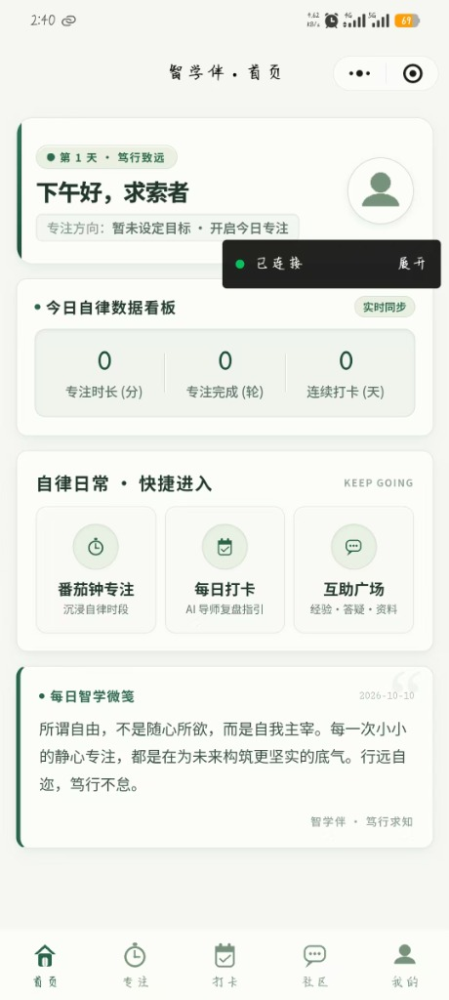 | 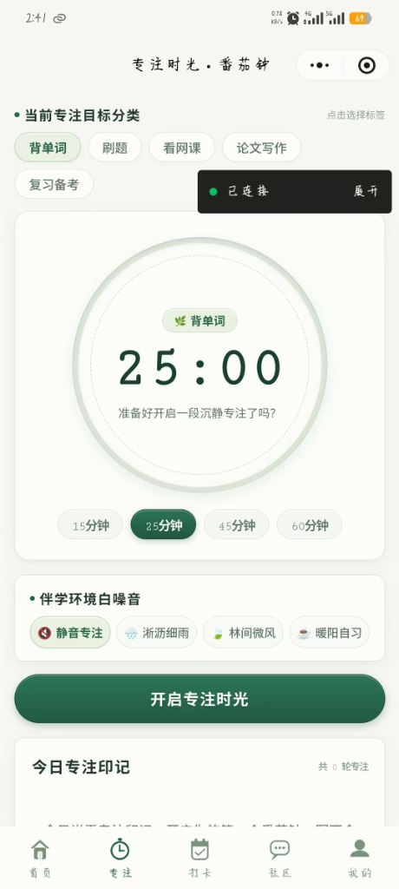 |
| **聚合多维指标**：个人累计专注总时长、连续打卡天数、自律积分金币与今日打卡任务直达。 | **沉浸式伴读**：25/45/60分钟标准番茄钟，结合微信后台音频播放雨声/自习室白噪音。 |

| 每日打卡与 AI 导师个性化复盘 | 社区互动与一键召唤 AI 助教答疑 |
| :---: | :---: |
| 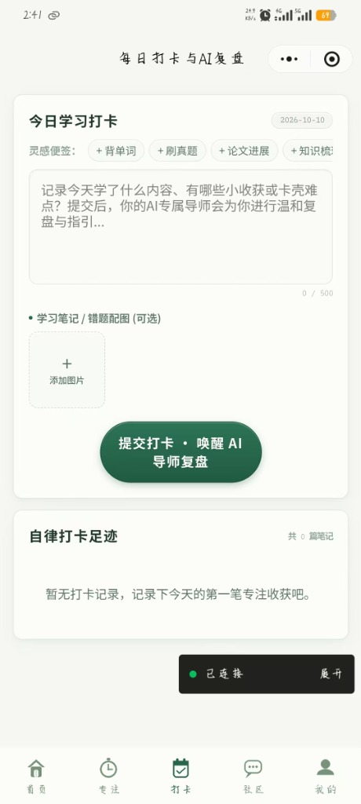 | 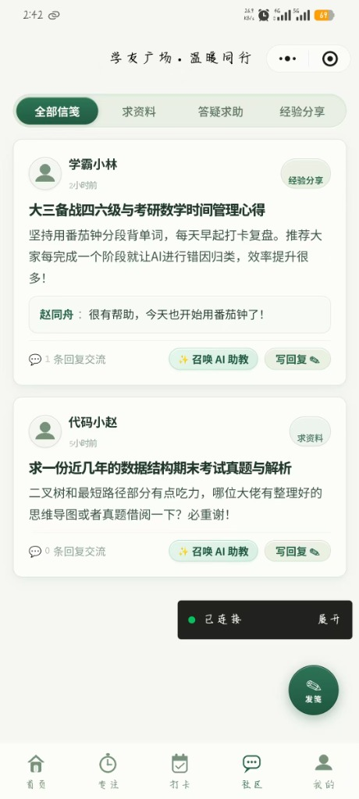 |
| **双轨 AI 导师复盘**：学员提交每日心得后，AI 导师结合学员目标与时长自动生成定制寄语。 | **一键呼叫助教**：社区疑难帖支持一键召唤 AI 助教，自动生成原理剖析与分步解题思路。 |

---

### 2. Vue 3 运营管理后台 · 全域治理与合规风控

| 平台态势指标概览大盘 | 学员档案管理与状态风控 |
| :---: | :---: |
| 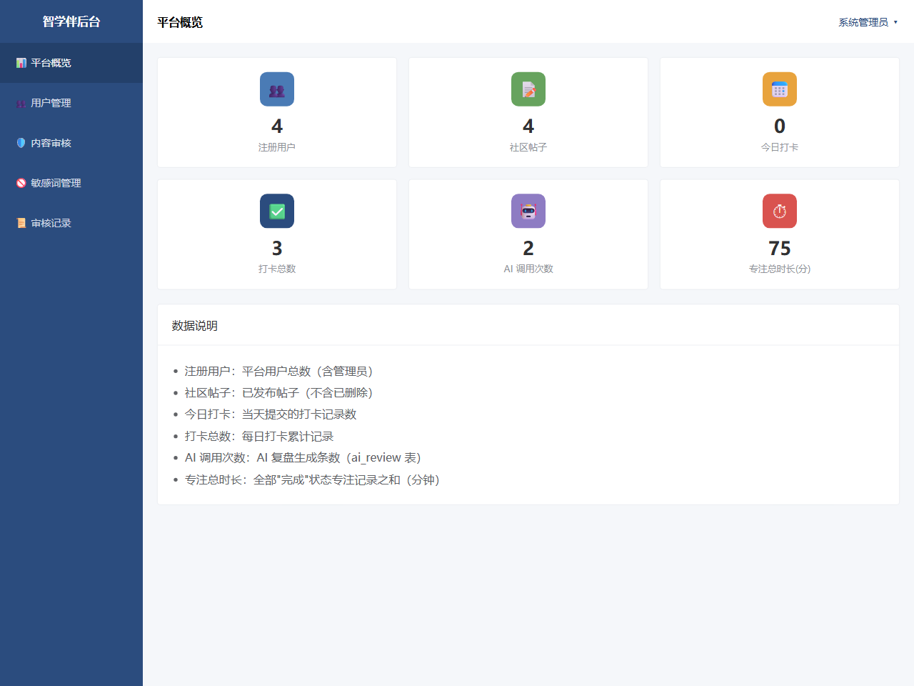 | 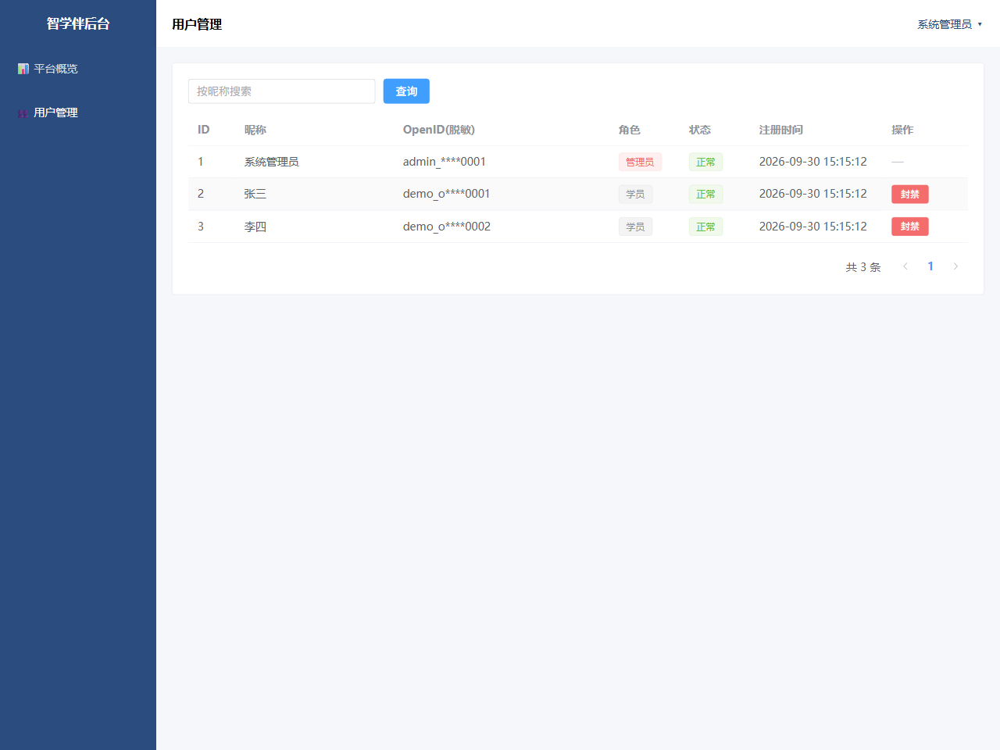 |
| **核心指标全局监控**：学员总量、专注累计时长、打卡总次数、AI 调用量实时看板。 | **生命周期管控**：学员档案多维检索，支持对违规账号执行一键封禁与权限冻结。 |

| 每日打卡与社区帖子集中审核 | 动态敏感词字典与审核日志留痕 |
| :---: | :---: |
| 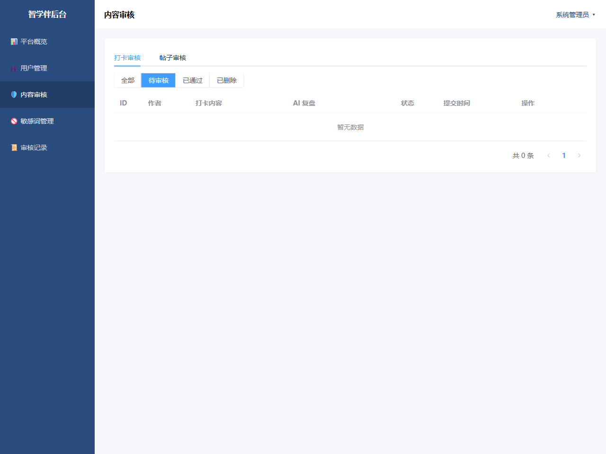 | 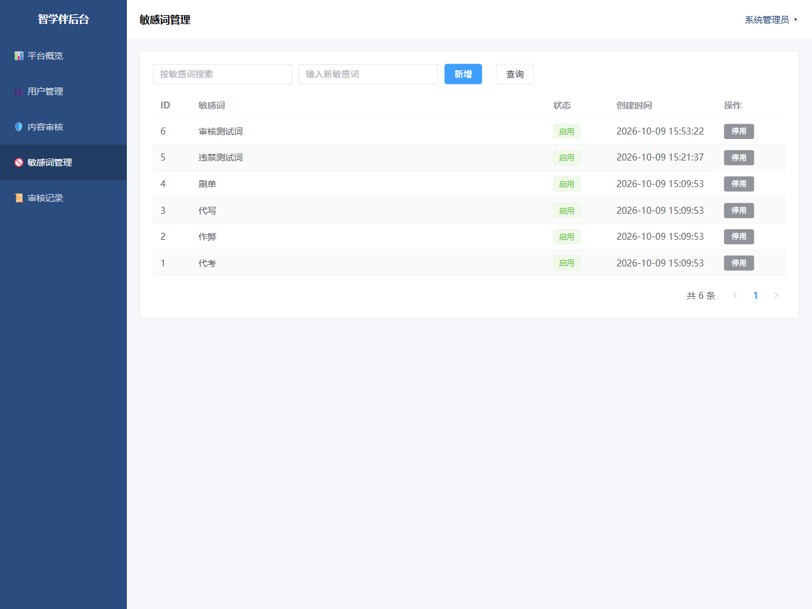 |
| **内容合规治理**：集中巡检全平台打卡心得与社区互助帖，支持驳回理由录入与违规下架。 | **风控零延时**：后台动态维护敏感词字典，无需重启后端即时生效；审核动作全量留痕。 |

---

## 🏗️ 规范化软件工程建模图纸

项目严格遵循现代软件工程规范，通过代码化建模工具（`build_diagrams.py`）自动生成高标准的 UML 架构图纸：

### 1. 每日打卡与双轨 AI 复盘时序图
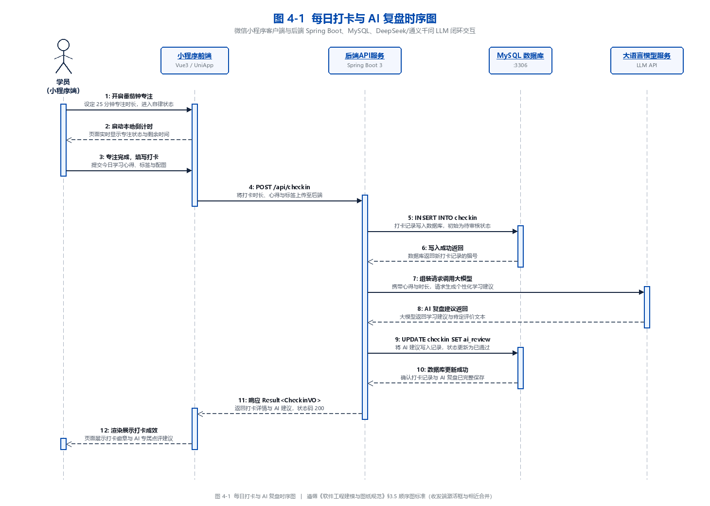

### 2. 社区发帖、敏感词拦截与 AI 助教交互时序图
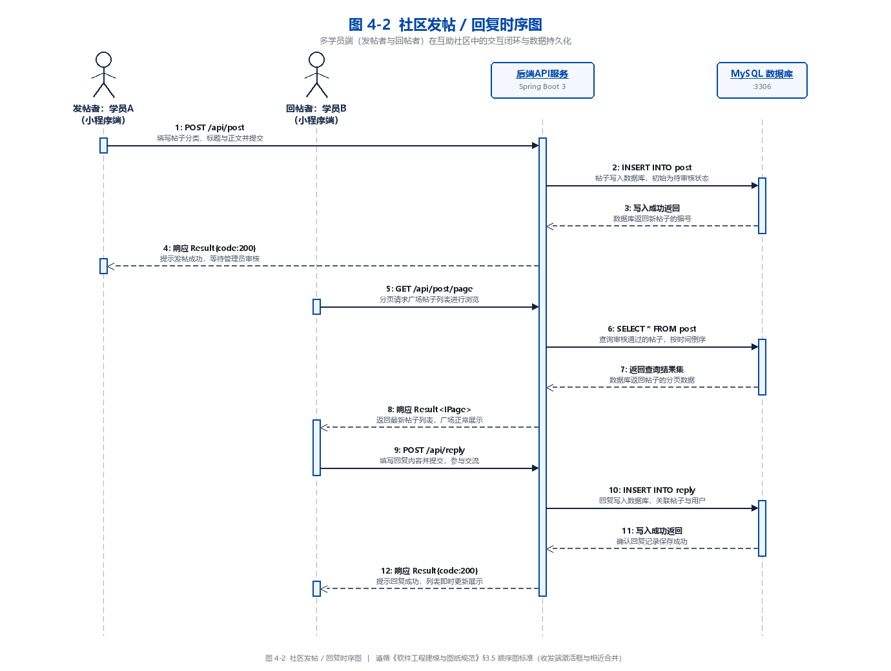

### 3. 系统 10 表关系模型 E-R 图
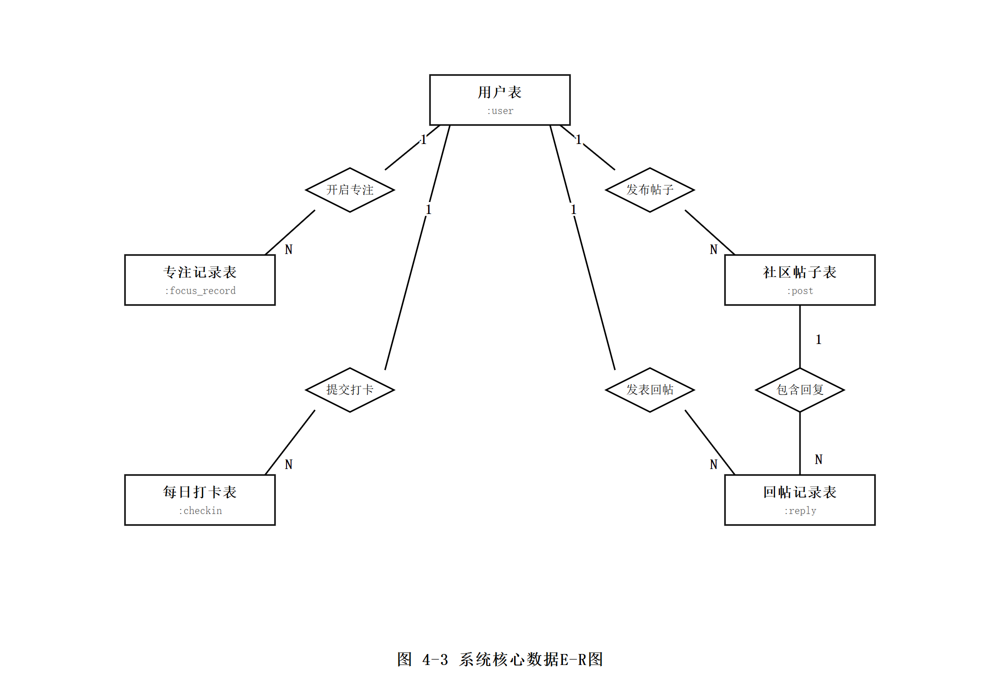

---

## 💡 核心工程创新点

### 1. 双轨自适应 AI 引擎架构 (Dual-Track AI Fallback)
* **主轨（Cloud LLM）**：基于 Spring `RestTemplate` 封装通用的 OpenAI / DeepSeek / 通义千问 Chat API，输出具备深度共情与专业解题思路的高质量文本。
* **从轨（Deterministic Fallback）**：针对弱网环境或 API 调用受限场景，设计了 5 秒超时熔断器与本地启发式规则模板库。当外部 API 发生异常时，系统在毫秒级内自动无缝降级为精炼的模板化点拨，保证学员端零白屏、零报错。

### 2. 前置词库风控与零脏数据保障 (Zero-Pollution Interception)
* 针对校园备考平台的学术合规要求，实现全局敏感词拦截器（`SensitiveWordInterceptor`）。
* 在学员发布打卡心得或社区帖子时，执行毫秒级模式匹配。一旦命中违禁词（如“代考”、“挂科”、“刷单”等），直接阻断请求并返回统一业务错误码 `1201`，实现违规内容**“零入库、零污染”**。

### 3. 数据隔离与安全加固 (Security & Data Isolation)
* **密码加盐哈希**：后台管理员采用 Spring Security 强单向加盐哈希算法（`BCryptPasswordEncoder`），杜绝数据库拖库安全隐患。
* **无状态 JWT 鉴权**：后台管理接口全量接入 JJWT 令牌校验机制，前端统一配置请求头拦截与 401 自动重定向。

---

## 🛠️ 技术选型清单

### 后端技术栈 (Backend)
| 技术项 | 选用版本 | 作用说明 |
| :--- | :--- | :--- |
| **Java 运行时** | Oracle JDK 21 LTS | 现代长期支持版本，具备卓越的虚拟线程与 GC 吞吐性能 |
| **核心框架** | Spring Boot 3.5.14 | 自动装配、内嵌 Tomcat 容器与模块化架构 |
| **持久层框架** | MyBatis-Plus 3.5.15 | 简化 CRUD、支持 Lambda 安全条件查询与 BaseMapper |
| **关系型数据库** | MySQL 8.0.43 (InnoDB) | 事务原子性保障，严格规范 10 张业务表主外键约束与索引 |
| **安全认证** | JJWT 0.13.0 | 模块化无状态令牌签发与鉴权拦截器 |
| **密码加密** | Spring Security Crypto | `BCryptPasswordEncoder` 强单向加盐哈希 |
| **构建管理** | Apache Maven 3.9+ | 依赖管理与跨平台构建 |

### 学员移动端 (WeChat Mini Program)
| 技术项 | 作用说明 |
| :--- | :--- |
| **原生开发框架** | 原生 WXML + WXSS + JavaScript，性能轻快，无第三方框架额外开销 |
| **音频调度引擎** | `wx.getBackgroundAudioManager` 支撑后台锁屏白噪音持续播放 |
| **本地缓存** | `wx.setStorageSync` 维护离线计时快照与学员配置 |

### 运营管理端 (Admin Web)
| 技术项 | 选用版本 | 作用说明 |
| :--- | :--- | :--- |
| **MVVM 框架** | Vue 3.5.34 | 采用 Composition API 与 `<script setup>` 响应式模式 |
| **UI 组件库** | Element Plus 2.13.7 | 现代化企业级中后台组件库（表格、抽屉、对话框） |
| **构建器** | Vite 8.0.0 | 极速冷启动与热更新 (HMR) |
| **路由与状态** | Vue Router 5 + Pinia 3 | 路由拦截鉴权与用户登录态持久化 |
| **网络请求** | Axios 1.13.6 | 统一请求拦截挂载 JWT，响应拦截捕获 401 |

---

## 🗄️ 数据库核心设计 (10 张完整业务表)

系统设计了严谨清晰的高范式关系模型，已包含完整的约束与级联维护：

1. **`user`（学员用户表）**：微信 OpenID 唯一凭证、昵称、头像、学习方向与自律学分（金币）。
2. **`focus_tag`（专注标签字典表）**：番茄钟科目分类（考研刷题/背单词/看网课），支持自定义色值。
3. **`focus_record`（番茄钟记录表）**：记录学员每一次专注起止时间、时长、标签及状态（完成/放弃）。
4. **`checkin`（每日打卡表）**：心得正文、笔记配图、审核状态与打卡时间戳。
5. **`ai_review`（AI 复盘明细表）**：1:1 关联打卡记录，记录 AI 生成的针对性寄语与调用模型标识。
6. **`post`（社区互助帖子表）**：分类（求资料/问问题/经验分享）、标题、详情及状态控制。
7. **`reply`（帖子回帖表）**：互动讨论回帖，支持系统虚拟用户（`999999`）专属 AI 助教答疑回帖。
8. **`admin`（后台管理员表）**：独立于普通学员的管理员账号、BCrypt 加密密码及状态标识。
9. **`audit_log`（审核合规流水表）**：详细记录管理员对打卡/帖子的下架原因、操作人与流水时间戳。
10. **`sensitive_word`（敏感词字典表）**：违规词内容与分类，支撑后台动态更新与前置拦截。

---

## 🚀 快速启动指南

### 1. 运行环境准备
* **JDK**：Java 21 LTS
* **Node.js**：v18+ (推荐 Node 20 / 22 / 24)
* **MySQL**：MySQL 8.0+
* **微信开发者工具**：用于调试运行小程序源码

### 2. 数据库一键初始化
1. 打开 MySQL 客户端或 Navicat / DataGrip，执行本项目提供的全量脚本：
   ```sql
   -- 执行 sql/01_init_all_10_tables.sql
   ```
2. 脚本将自动创建 `zhixueban` 数据库，构建全部 10 张表并预置测试账号、敏感词库与示范帖子。

### 3. 后端服务启动
1. 检查 `backend/src/main/resources/application.yml` 中的 MySQL 账号密码（默认 `root / 123456`）。
2. 进入 `backend/` 目录启动 Spring Boot：
   ```bash
   mvn spring-boot:run
   ```
3. 服务正常启动于：`http://127.0.0.1:8080`。

### 4. Vue 3 管理后台启动
1. 进入 `frontend/admin-web/` 目录安装依赖并启动：
   ```bash
   npm install
   npm run dev
   ```
2. 打开浏览器访问：`http://127.0.0.1:5174`。
3. **预设管理员账号**：`admin` / **密码**：`admin123`。

### 5. 微信小程序导入与运行
1. 打开**微信开发者工具**，选择“导入项目”。
2. 目录选择 `frontend/mp-weixin/`，AppID 可填入测试号或个人小程序 ID。
3. 点击编译，即可在内置模拟器体验番茄钟计时、每日打卡与社区互动！

---

## 📋 完整工程交付文档索引

* 📄 **[01_作品集截图](./01_作品集截图/)**：涵盖小程序、Web 后台与 UML 建模图纸共 13 张 1080P 高清图。
* 📄 **[02_功能清单.md](./02_功能清单.md)**：包含 14 项全流程业务功能的详细技术规格说明。
* 📄 **[03_技术栈与项目结构.md](./03_技术栈与项目结构.md)**：端到端分层架构、通信链路与完整工程目录说明。
* 📄 **[04_运行验证记录.md](./04_运行验证记录.md)**：真实环境启动输出、压测与逐项业务实测测试记录。

---

## 📄 开源与交付协议

本项目遵循 **MIT License** 规范。仅供个人技术交流、学习探索与作品展示使用。
