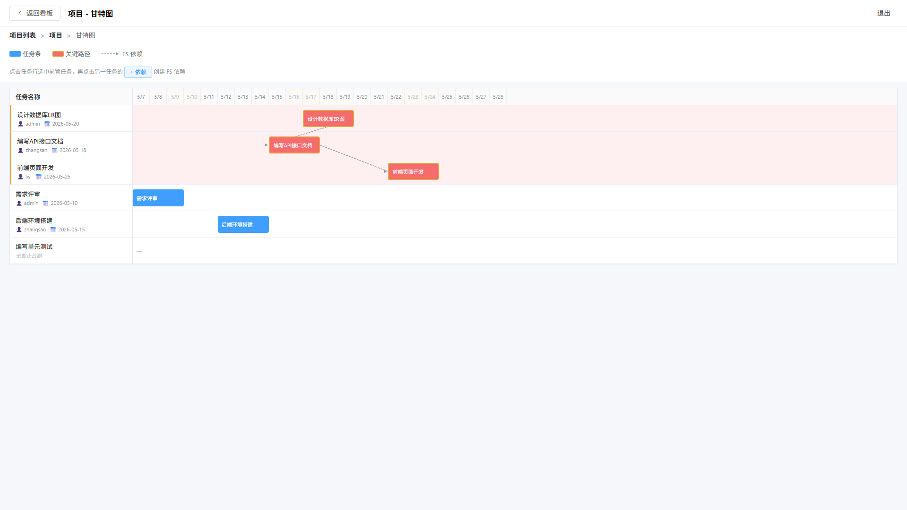
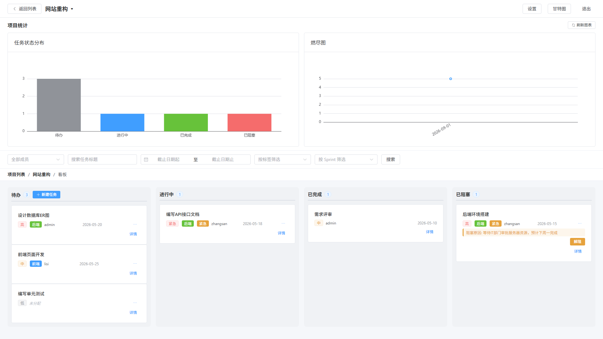
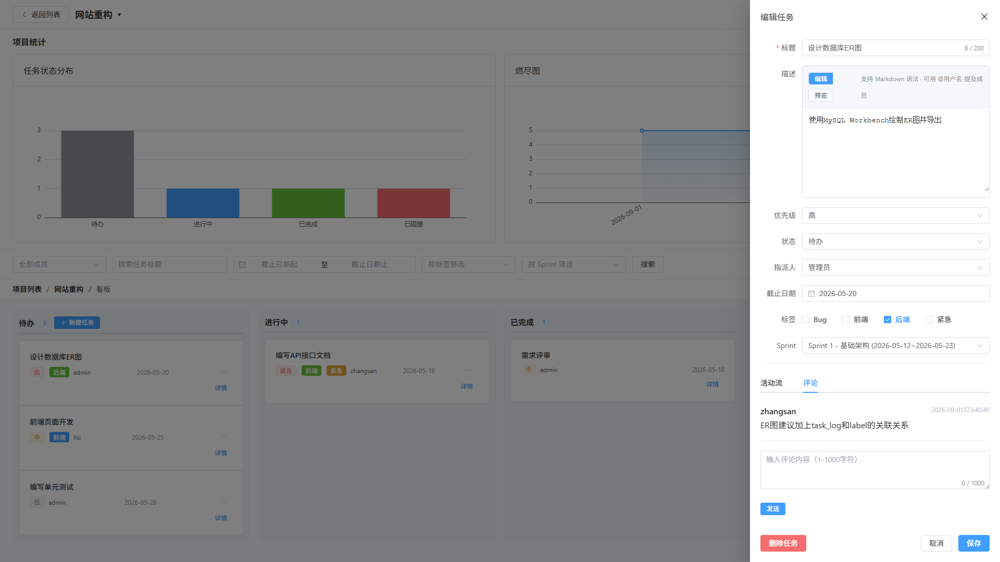
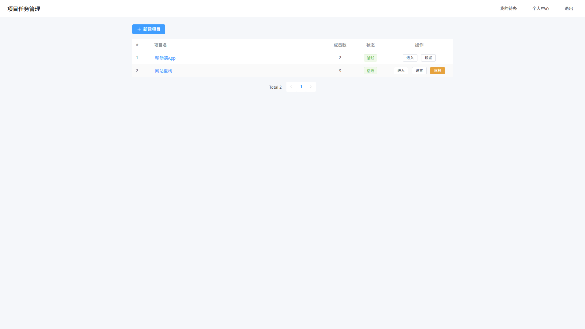
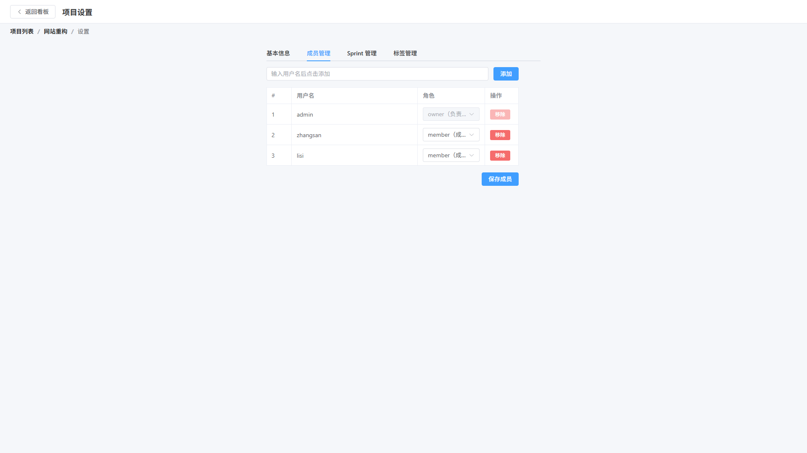

# 看板式敏捷项目任务管理系统 (Kanban Task Management System)

<p align="center">
  
  
  
  
  
  
  
</p>

---

## 📖 项目简介

**看板式敏捷项目任务管理系统** 是一套面向敏捷研发团队与中小型协作场景的前后端分离中后台系统。针对团队任务跟踪不透明、排期甘特图缺乏联动、状态流转缺乏审计以及效能统计滞后等业务痛点，系统基于 **Spring Boot 3 + Vue 3** 架构搭建，提供了从“多项目权限管控、四列敏捷看板流转、甘特图关键路径分析、交付燃尽图效能统计到任务操作审计流水”的 **14 项全流程业务功能闭环**。

本项目遵循企业级标准交付规范，工程结构清晰、表结构严谨，全链路功能均在真实环境实测通过。

---

## 🌟 核心业务功能与界面展示

### 1. 敏捷任务看板（四列状态机流转）
* 支持 **待办 (Todo)、进行中 (In Progress)、已完成 (Done)、已阻塞 (Blocked)** 四大核心状态列。
* 集成 **VueDraggable / SortableJS** 实现平滑的跨列拖拽流转与同列优先级重新排序，后端批量持久化 `order_no`。
* 内置**阻塞审批机制**：任务标记为“已阻塞”时必须填写阻塞原因；仅项目负责人（Owner）拥有解阻权限。


---

### 2. 甘特图排期与关键路径拓扑分析
* 按时间轴维度直观渲染多任务周期排期条与里程碑交付节点。
* 支持任务间 **FS（Finish-to-Start）依赖关系绑定**，系统算法自动计算并**高亮关键路径（Critical Path）**，识别潜在交付瓶颈。



---

### 3. 项目效能统计与动态交付燃尽图
* 集成 **ECharts 6.0**，实时动态加载当前项目的效能统计指标。
* **状态分布柱状图**：多维度汇总各状态任务分布。
* **Sprint 交付燃尽图**：折线面积图呈现随迭代周期推进的剩余任务下潜趋势，辅助团队评估交付健康度。



---

### 4. 任务详情、操作审计流与协同讨论抽屉
* 点击卡片一键唤起侧边抽屉，查看任务元数据、Markdown 富文本描述、负责人与标签徽章。
* **操作审计流水**：自动记录任务创建、指派变更、状态流转的完整系统操作日志。
* **实时讨论流**：团队成员可在任务抽屉内发表针对性评论与回复。



---

### 5. 多项目管理与细粒度成员角色隔离
* 针对用户参与的项目提供独立的列表视图、进度卡片与归档管理。
* 细粒度角色隔离：项目负责人（`owner`）可管理成员与修改配置，项目成员（`member`）仅操作关联任务；内置**“禁止移除唯一负责人”**防孤儿数据保护逻辑。

| 项目列表汇总 | 成员权限管理 |
| :---: | :---: |
|  |  |

---

## 🏗️ 系统分层架构

系统采用清晰的前后端解耦与分层架构，保障了高内聚与低耦合：

```text
[Vue 3 视图组件层] (ProjectBoard / Gantt / Stats / Settings / MyTasks)
       │
       ▼
[Axios API 封装层] (统一提取 token 注入 Authorization: Bearer <JWT>)
       │
       ▼
[Vite 代理 / HTTP] (http://127.0.0.1:8080/api/**)
       │
       ▼
[Spring Boot 拦截器] (LoginInterceptor 校验 JWT 签名并解密 userId)
       │
       ▼
[Controller 控制器] (入参 JSR-303 @Valid 校验，调用对应 Service)
       │
       ▼
[Service 业务逻辑] (Owner/Member 权限鉴权、状态机流转控制、@Transactional 事务)
       │
       ▼
[MyBatis-Plus 持久层] (BaseMapper 接口继承、LambdaQueryWrapper 条件构造)
       │
       ▼
[MySQL 8.0 数据库] (project_db, 10 张核心关联业务表)
       │
       ▼
[统一响应封装 Result<T>] (Axios 响应拦截器统一解包，401 自动跳转，异常友好提示)
```

---

## 🛠️ 技术选型清单

### 后端技术栈 (Backend)
| 技术项 | 选用版本 | 作用说明 |
| :--- | :--- | :--- |
| **Java 运行时** | Oracle JDK 21 LTS | 现代长期支持版本，提供出色的吞吐与性能 |
| **核心框架** | Spring Boot 3.5.14 | 模块化自动装配、内嵌 Tomcat 容器 |
| **持久层组件** | MyBatis-Plus 3.5.15 | 简化 CRUD、Lambda 表达式安全查询、内置通用 BaseMapper |
| **数据库** | MySQL 8.0.43 (InnoDB) | 关系型存储，采用 utf8mb4 字符集与事务原子保障 |
| **安全认证** | JJWT 0.13.0 | 模块化无状态令牌签发与拦截校验 |
| **密码加盐加密** | Spring Security Crypto | `BCryptPasswordEncoder` 单向加盐哈希，杜绝明文风险 |
| **代码简化** | Project Lombok | 消除冗余 Getter/Setter 与日志样板代码 |
| **构建管理** | Apache Maven 3.9+ | 依赖管理与打包构建 |

### 前端技术栈 (Frontend)
| 技术项 | 选用版本 | 作用说明 |
| :--- | :--- | :--- |
| **MVVM 框架** | Vue 3.5.34 | 采用 Composition API 与 `<script setup>` 响应式架构 |
| **组件库** | Element Plus 2.13.7 | 现代化企业级中后台 UI 规范组件库 |
| **工程构建器** | Vite 8.0.0 | 秒级冷启动与极速热模块替换 (HMR) |
| **路由系统** | Vue Router 5.0.6 | HTML5 History 模式与全局导航守卫鉴权 |
| **全局状态** | Pinia 3.0.4 | 轻量直观的状态管理中心 |
| **网络请求** | Axios 1.13.6 | 统一封装请求拦截与 401 鉴权状态捕获 |
| **图表引擎** | ECharts 6.0.0 | 高性能 Canvas 图表可视化（柱状图、交付燃尽图） |
| **拖拽交互** | VueDraggable + SortableJS | 支撑看板任务卡片跨列流转与排序 |

---

## 🗄️ 数据库核心设计 (10 张业务表)

系统设计了规范严谨的实体关系模型，包含外键约束与级联维护：

1. **`user`（用户表）**：系统账号、BCrypt 加密密码、邮箱与头像。
2. **`project`（项目表）**：项目基础元数据、当前状态与归档标识。
3. **`project_member`（项目成员关联表）**：维护 `owner` 与 `member` 角色权限映射。
4. **`task`（任务表）**：标题、Markdown 描述、优先级、四列状态、截止日期、所属 Sprint。
5. **`label`（标签字典表）**：自定义标签名称与取色器颜色代码（Hex）。
6. **`task_label`（任务标签映射表）**：多对多映射，支持级联清理。
7. **`milestone`（Sprint 里程碑表）**：迭代周期排期与状态推断。
8. **`task_dependency`（任务依赖表）**：甘特图 FS 依赖拓扑关联映射。
9. **`task_log`（操作日志与审计表）**：记录用户操作流水与状态变动记录。
10. **`task_transition`（状态流转历史表）**：统计看板各状态停留周期。

---

## 🚀 快速启动指南

### 1. 运行环境准备
* **JDK**：Java 21 LTS
* **Node.js**：v18+ (推荐 Node 20 / 22)
* **MySQL**：MySQL 8.0+

### 2. 数据库初始化
1. 创建数据库 `project_db`：
   ```sql
   CREATE DATABASE project_db DEFAULT CHARACTER SET utf8mb4 COLLATE utf8mb4_unicode_ci;
   ```
2. 执行工程内的初始化脚本 `sql/01-init.sql` 完成 10 张表与预置演示数据的导入。

### 3. 后端服务启动
1. 检查 `backend/src/main/resources/application.yml` 中的 MySQL 账号与密码。
2. 在 `backend/` 目录下执行 Maven 启动：
   ```bash
   mvn spring-boot:run
   ```
3. 后端服务监听于：`http://127.0.0.1:8080`。

### 4. 前端工程启动
1. 进入 `frontend/` 目录安装依赖：
   ```bash
   pnpm install  # 或 npm install
   ```
2. 启动前端 Vite 开发服务器：
   ```bash
   pnpm dev      # 或 npm run dev
   ```
3. 打开浏览器访问：`http://127.0.0.1:5173`。

### 5. 系统演示账号
* **管理员/测试账号**：`admin`
* **默认密码**：`password123`

---

## 📋 完整工程交付文档索引

本项目包含完整的企业级交付与验证记录，更多细节请查阅同级目录文档：

* 📄 **[01_作品集截图](./01_作品集截图/)**：涵盖 13 张完整 1080P 真实系统运行高清截图。
* 📄 **[02_功能清单.md](./02_功能清单.md)**：包含 14 项业务模块的详细接口与实现规格说明。
* 📄 **[03_技术栈与项目结构.md](./03_技术栈与项目结构.md)**：后端 Controller/Service/Mapper 架构与前端视图目录映射。
* 📄 **[04_运行验证记录.md](./04_运行验证记录.md)**：真实环境启动结果、核心业务实测记录与测试结论。

---

## 📄 开源与交付协议

本项目遵循 **MIT License** 规范。仅供个人学习、技术交流与作品展示使用。
